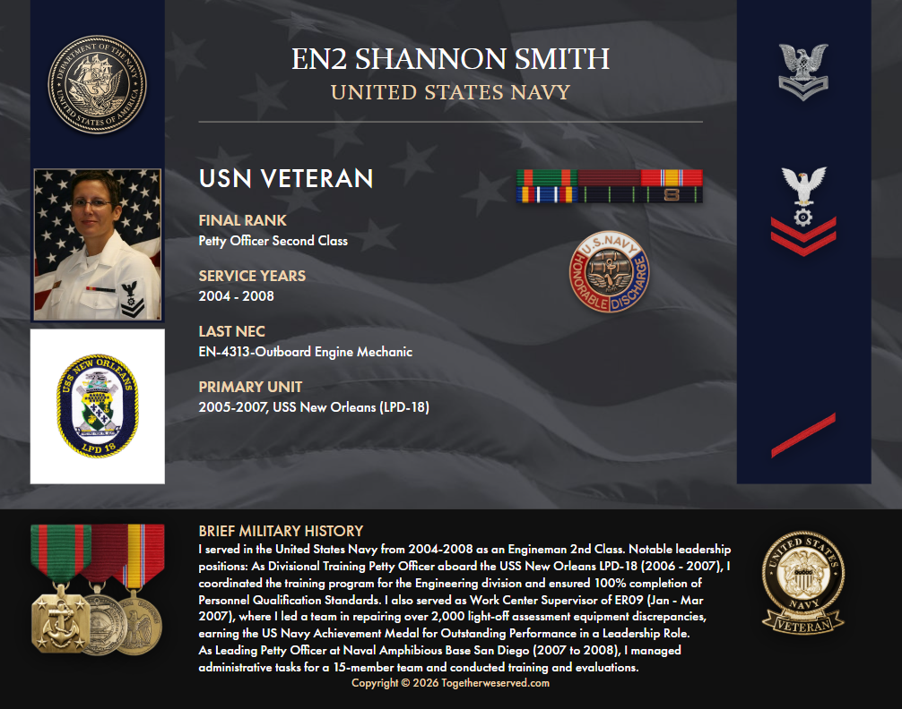

<div align="center">

# 👋 Shannon Smith

**Cybersecurity Engineer | SOC Systems • Detection Engineering • Agentic Investigation | U.S. Navy Veteran**


My work focuses on building **SOC-style security systems** that simulate how analysts triage, investigate, and respond to threats — combining **offensive understanding with defensive detection and structured investigation workflows**.

</div>

---

## 🎯 Portfolio

<div align="center">
  
</div>

<p align="center">
Security investigations, labs, and technical writeups.<br>
👉 https://shannonasmith.github.io/
</p>

---

## 🚀 Current Project Focus

### 🧠 Agentic SOC Platform (v2)

```text
Alert → Detection → Investigation → Decision
```

Building an evolving **modular SOC system** designed to replicate real-world investigation pipelines:

- alert ingestion and normalization  
- entity extraction (IPs, domains, hashes, users)  
- enrichment and MITRE ATT&CK mapping  
- detection logic and confidence scoring  
- investigation workflows and correlation  
- response recommendation and playbook design  
- evidence validation and structured outputs  

---

## 🧠 SOC System Perspective

| Stage | Focus |
|------|------|
| Alert Analysis | Understanding and triaging events |
| Detection Engineering | Mapping behavior to ATT&CK |
| Investigation | Enrichment and correlation |
| Decision Support | Response guidance and automation |

---

## 🛠 Technical Skills

**Operating Systems**: <br>
- Linux (Kali, Ubuntu) • Windows  

**Languages & Scripting**: <br>
- Python • Bash • Java • SQL  

**Security Tools**: <br>
- Nmap • Wireshark • Burp Suite • Metasploit • BloodHound  
- Splunk • ELK Stack • Zeek • Sysmon  

**Core Specialties**: <br>
- Security Operations (SOC) & Detection Engineering  
- Offensive Security • Red / Blue / Purple Teaming  
- Threat Hunting • Incident Response  
- Network Security • Infrastructure Security  
- Malware Analysis • Vulnerability Management  

---

## 🧪 Applied Cybersecurity Work

- SOC-style alert analysis and triage pipelines  
- MITRE ATT&CK mapping and detection workflows  
- investigation and enrichment pipelines  
- CTF-based offensive and defensive analysis  
- enterprise-style cybersecurity home lab design  
- network traffic analysis and log-based detection  

---

## 🏅 Certifications

GIAC **GFACT – Foundational Cybersecurity Technologies**  
Certified Ethical Hacker (**CEH**)  
CompTIA **Security+**  
CompTIA **Linux+**  
Splunk **Core Certified Power User (CCPU)**  

---

## 📚 WiCyS/SANS Training Track (In Progress)

SEC401 – Security Essentials  
SEC504 – Hacker Tools, Techniques & Incident Handling  

---

## 🎓 Education

**Master of Information Technology**  
Virginia Tech — 2023  

Graduate Certificates  
• Software Development  
• Cybersecurity Policy  

**Bachelor of Science in Technical Management**  
DeVry University — 2017  

---

## 💼 Experience Highlights

- U.S. Navy Veteran — leadership & operational discipline  
- Active Capture-the-Flag (CTF) competitor  
- Cybersecurity home lab design & attack simulation  
- Network traffic analysis and structured investigation workflows  

---

## U.S. Navy Service

<div align="center">
  
</div>

Petty Officer Second Class (E-5)  
United States Navy (2004–2008)  
USS New Orleans (LPD-18)  

---

## 🔎 Current Focus

- advancing detection engineering capabilities  
- strengthening investigation and correlation workflows  
- building a modular SOC platform (Agentic SOC Engine v2)  
- expanding AI-assisted security workflows  

---

## 🌱 Beyond Cybersecurity

Outside of security, I enjoy cycling and creative disciplines like woodworking and art — practices that reinforce patience, precision, and continuous improvement.

---

### 🤝 Connect With Me

**Portfolio**: https://shannonasmith.github.io/  
**LinkedIn**: https://www.linkedin.com/in/shannonasmith  
**Credly**: https://www.credly.com/users/shannon-smith-it-usn  

---

<div align="center">

🛡 **Security is not a checklist — it’s a system.**

</div>
