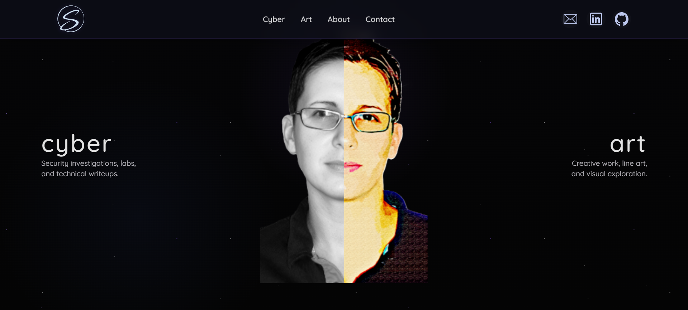

# 👋 Shannon Smith

**Security Operations | Detection Engineering | Threat Investigation | U.S. Navy Veteran**

  

My work focuses on building **SOC-style security systems** that simulate how analysts triage, investigate, and respond to threats — combining **offensive understanding with defensive detection and structured investigation workflows**.

---

## 🎯 Portfolio

  

Security investigations, labs, and technical writeups. 
👉 https://shannonasmith.github.io/

---

## 🧠 Skills in Practice

| Skill | Applied In |
|------|------------|
| **SOC Alert Triage** | [AI-Assisted SOC Alert Analyzer](https://github.com/shannonasmith/AI-Assisted-SOC-Alert-Analyzer) |
| **MITRE ATT&CK Mapping** | [SOC MITRE ATT&CK Mapping Engine](https://github.com/shannonasmith/AI-Assisted-SOC-MITRE-ATTACK-Mapping-Engine) |
| **Investigation Workflows** | [Agentic SOC Investigation Engine](https://github.com/shannonasmith/Agentic-SOC-Investigation-Engine) |
| **Detection Engineering** | Custom rule-based + hybrid scoring pipelines |
| **Threat Hunting & Correlation** | Batch analysis, severity distribution, IP relationship mapping |
| **Automation & Scripting** | Python-based SOC pipelines and CLI workflows |

---

## 🛠 Technical Skills

| Category | Technologies & Tools |
|------|------------|
| **Operating Systems** | Linux (Kali, Ubuntu) • Windows |
| **Languages & Scripting** | Python • Bash • Java • SQL |
| **Security Tools** | Nmap • Wireshark • Burp Suite • Metasploit • BloodHound   Splunk • ELK Stack • Zeek • Sysmon |
| **Core Specialties** | Security Operations (SOC) • Detection Engineering   Offensive Security • Red / Blue / Purple Teaming   Threat Hunting • Incident Response   Network Security • Infrastructure Security   Malware Analysis • Vulnerability Management |

---

## 🧪 Applied Cybersecurity Work

- SOC-style alert analysis and triage pipelines  
- MITRE ATT&CK mapping and detection workflows  
- investigation and enrichment pipelines  
- CTF-based offensive and defensive analysis  
- enterprise-style cybersecurity home lab design  
- network traffic analysis and log-based detection  

---

## 🏅 Certifications

- GIAC **GFACT** – Foundational Cybersecurity Technologies  
- Certified Ethical Hacker (**CEH**)  
- CompTIA **Security+**  
- CompTIA **Linux+**  
- Splunk **Core Certified Power User (CCPU)**  

---

## 📚 WiCyS/SANS Training Track (In Progress)

- SEC401 – Security Essentials (**GSEC**)  
- SEC504 – Hacker Tools, Techniques & Incident Handling (**GCIH**)

---

## 🎓 Education

- **Master of Information Technology** — Virginia Tech (2023)  
Graduate Certificates: Software Development and Cybersecurity Policy  

- **Bachelor of Science in Technical Management** — DeVry University (2017)

---

## 💼 Experience Highlights

- U.S. Navy Veteran — leadership & operational discipline  
- Active Capture-the-Flag (CTF) competitor  
- Cybersecurity home lab design & attack simulation  
- Network traffic analysis and structured investigation workflows  

---

## U.S. Navy Service

  

 United States Navy (2004–2008) - Petty Officer Second Class (E-5) - USS New Orleans (LPD-18)

  

---

## 🌱 Beyond Cybersecurity

Outside of security, I enjoy cycling and creative disciplines like woodworking and art — practices that reinforce patience, precision, and continuous improvement.

---

### 🤝 Connect With Me

**Portfolio**: https://shannonasmith.github.io/  
**LinkedIn**: https://www.linkedin.com/in/shannonasmith  
**Credly**: https://www.credly.com/users/shannon-smith-it-usn  

---

🛡 **Security is not a checklist — it’s a system.**

